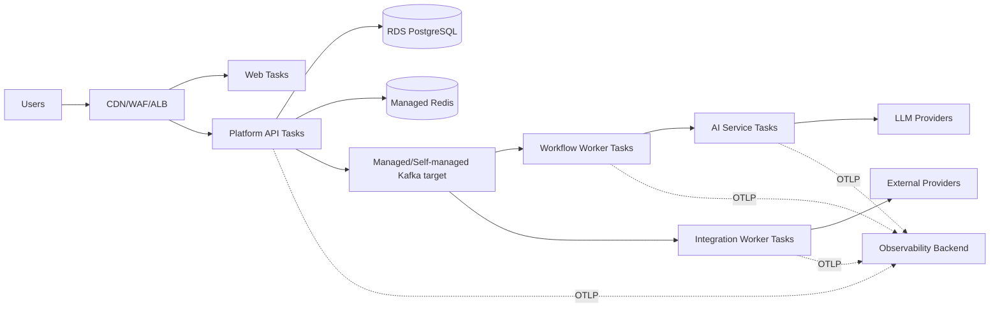

# Deployment View

## Local

Host: web/API/workers com hot reload. Containers: PostgreSQL/Redis; eventing/observability entram por fase.

## AWS target

ECS/Fargate é direção inicial; EKS só após ADR posterior.
