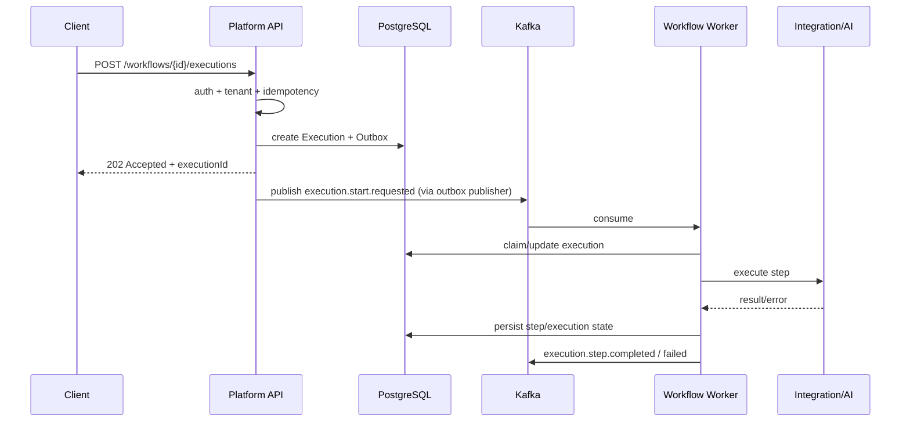

# Sequence — Workflow Execution

```mermaid
sequenceDiagram
    participant C as Client
    participant API as Platform API
    participant DB as PostgreSQL
    participant K as Kafka
    participant W as Workflow Worker
    participant I as Integration/AI

    C->>API: POST /workflows/{id}/executions
    API->>API: auth + tenant + idempotency
    API->>DB: create Execution + Outbox
    API-->>C: 202 Accepted + executionId
    API->>K: publish execution.start.requested (via outbox publisher)
    K->>W: consume
    W->>DB: claim/update execution
    W->>I: execute step
    I-->>W: result/error
    W->>DB: persist step/execution state
    W->>K: execution.step.completed / failed
```

A sequência final pode variar durante M03/M04, mas dual-write e idempotency precisam permanecer explícitos.
